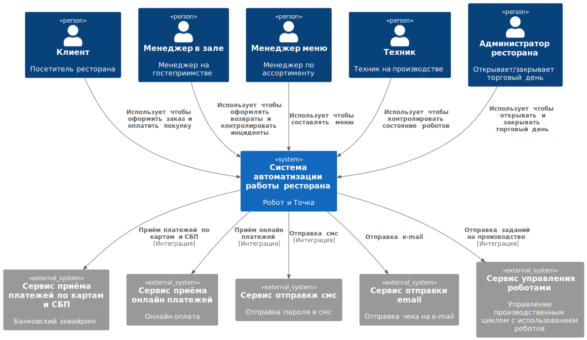
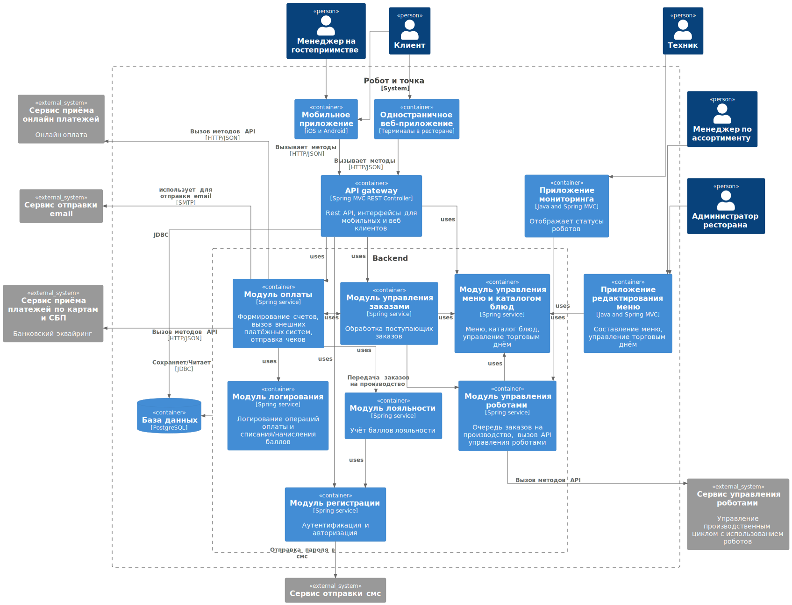

# Компонентная архитектура
## Обоснование архитектурного стиля
Компания Робот и Точка планирует применить инновационный подход к автоматизации пищевого производства.  
Эффективность такого решения должна быть проверена на практике,
 сроки выпуска пилотного проекта очень сжатые. 
 Для того, чтобы как можно скорее запустить в работу MVP и приступить к 
 практическому изучению эффективности роботизации, выбран подход "Monolith first" (Монолит первый).
 Преимущества такого подхода:
 
 + Скорость разработки. Монолитное решение проще в реализации и может быть быстрее выпущено.
 + Архитектурное решение простое, не требует больших затрат на подготовку инфраструктуры развёртывания,
 доставки изменений, согласования большого количества сервисов, технологических решений. 
 Больше ресурсов команды разработки можно задействовать на реализацию функциональных возможностей системы.
+ Монолитное решение имеет высокую производительность, поскольку нет необходимости выстраивать межсервисное взаимодействие.

На этапе запуска MVP, проектирование монолитного приложения для оценки эффективности роботизации выглядит оптимальным.

## Диаграмма контекста

## Диаграмма компонентов

