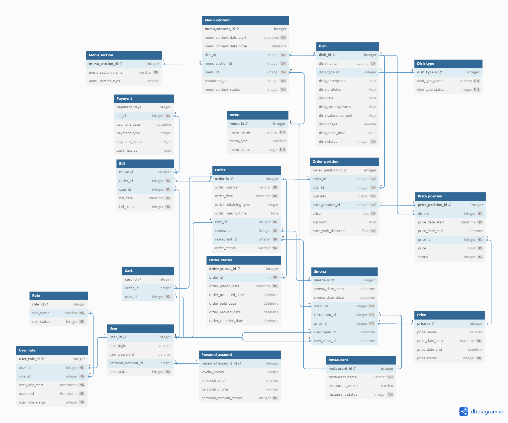

# Информационная модель системы

## Диаграмма классов для модуля оформления заказа и модуля оплаты

## Модель данных

## Спецификация модели данных

### Объекты базы данных

| № | Наименование | Назначение объекта | Тип объекта |
| - | --- | --- | --- |
| 1 | User | Пользователи системы | Таблица |
| 2 | Personal_account | Личный кабинет зарегистрированных пользователей | Таблица |
| 3 | Role | Роли пользователей | Таблица |
| 4 | User_role | Связь пользователей и ролей | Таблица |
| 5 | Restaurant | Справочник ресторанов | Таблица |
| 6 | Order | Таблица заказов | Таблица |
| 7 | Order_status | Таблица статусов заказа | Таблица |
| 8 | Order_position | Состав заказа | Таблица |
| 9 | Dish | Каталог блюд | Таблица |
| 10 | Dish_type | Справочник типов блюд | Таблица |
| 11 | Menu | Справочник меню | Таблица |
| 12 | Menu_section | Разделы меню | Таблица |
| 13 | Menu_content | Содержимое раздела меню | Таблица |
| 14 | Price | Справочник прейскурантов | Таблица |
| 15 | Price_position | Позиции прейскуранта | Таблица |
| 16 | Bill | Счета на оплату | Таблица |
| 17 | Payment | Платежи | Таблица |
| 18 | Smena | Торговые дни | Таблица |

### Поля таблиц

| Таблица | Поле | Тип данных | Комментарий |
| - | --- | --- | --- |
| User | user_id | integer | Уникальный идентификатор |
| User | user_login | varchar | Логин пользователя |
| User | user_password | varchar | Пароль пользователя |
| User | personal_account_id | integer | Связь с таблицей личного кабинета пользователя |
| User | user_status | integer | Сатус записи: 0 активна, 99 не активна |
| Personal_account | personal_account_id | integer | Уникальный идентификатор |
| Personal_account | loyalty_points | integer | Баллы лояльности |
| Personal_account | personal_email | varchar | Адрес электронной почты |
| Personal_account | personal_phone | varchar | Телефон |
| Personal_account | personal_account_status | integer | Сатус записи: 0 активна, 99 не активна |
| Role | role_id | integer | Уникальный идентификатор |
| Role | role_name | varchar | Название роли |
| Role | role_status | integer | Сатус записи: 0 активна, 99 не активна |
| User_role | user_role_id | integer | Уникальный идентификатор |
| User_role | user_id | integer | Связь с таблицей пользователей |
| User_role | role_id | integer | Связь с таблицей ролей |
| User_role | user_role_start | timestamp | Начало действия роли |
| User_role | user_end timestamp | timestamp | Завершение действия роли |
| User_role | user_role_status | integer | Сатус записи: 0 активна, 99 не активна |
| Order | order_id | integer | Уникальный идентификатор |
| Order | order_number | varchar | Номер заказа |
| Order | order_date | timestamp | Дата заказа |
| Order | order_obtaining_type | integer | Способ получения заказа, 1 - с собой, 2 - в зале |
| Order | order_making_time | time | Расчётное время приготовления заказа |
| Order | user_id | integer | Связь с таблицей пользователей |
| Order | smena_id | integer | Связь с таблицей торгового дня |
| Order | restaurant_id | integer | Связь с таблицей ресторанов |
| Order | order_status | varchar | Сатус записи: 0 активна, 99 не активна |
| Order_status | order_status_id | integer | Уникальный идентификатор |
| Order_status | order_id | integer | Связь с таблицей заказов |
| Order_status | order_placed_date | timestamp | Дата и время размещения заказа |
| Order_status | order_prepared_date | timestamp | Дата и время завершения приготовления заказа |
| Order_status | order_paid_date | timestamp | Дата и время оплаты заказа |
| Order_status | order_recived_date | timestamp | Дата и время получения заказа |
| Order_status | order_canceled_date | timestamp | Дата и время отмены заказа |
| Order_position | order_position_id | integer | Уникальный идентификатор |
| Order_position | order_id | integer | Связь с таблицей заказов |
| Order_position | dish_id | integer | Связь с таблицей каталога блюд |
| Order_position | count | integer | Количество |
| Order_position | price_position_id | integer | Связь с таблицей позиций прейскуранта |
| Order_position | price | float | Цена |
| Order_position | discount | float | Скидка |
| Order_position | price_with_discount | float | Цена со скидкой |
| Restaurant | restaurant_id | integer | Уникальный идентификатор |
| Restaurant | restaurant_name | varchar | Название ресторана |
| Restaurant | restaurant_adress | varchar | Адрес ресторана |
| Restaurant | restaurant_status | integer | Сатус записи: 0 активна, 99 не активна |
| Dish | dish_id | integer | Уникальный идентификатор |
| Dish | dish_name | varchar | Название блюда |
| Dish | dish_type_id | integer | Связь с таблицей типов блюд |
| Dish | dish_description | text | Описание блюда |
| Dish | dish_proteins | float | Белки |
| Dish | dish_fats | float | Жиры |
| Dish | dish_carbohydrates | float | Углеводы |
| Dish | dish_calorie_content | float | Общая каллорийность |
| Dish | dish_image | varchar | Ссылка на изображение блюда |
| Dish | dish_make_time | time | Нормативное время приготовления блюда |
| Dish | dish_status | integer | Сатус записи: 0 активна, 99 не активна |
| Dish_type | dish_type_id integer [primary key] | integer | Уникальный идентификатор |
| Dish_type | dish_type_name | varchar | Название типа блюда |
| Dish_type | dish_type_status | integer | Сатус записи: 0 активна, 99 не активна |
| Menu | menu_id | integer | Уникальный идентификатор |
| Menu | menu_name | varchar | Название меню |
| Menu | menu_type | varchar | Тип меню |
| Menu | menu_status | integer | Сатус записи: 0 активна, 99 не активна |
| Menu_section | menu_section_id | integer | Уникальный идентификатор |
| Menu_section | menu_section_name | varchar | Название раздела меню |
| Menu_section | menu_section_type | varchar | Тип раздела меню |
| Menu_content | menu_content_id | integer | Уникальный идентификатор |
| Menu_content | menu_content_date_start | timestamp | Дата начала действия позиции меню |
| Menu_content | menu_content_date_close | timestamp | Дата окончания действия позиции меню |
| Menu_content | dish_id | integer | Связь с таблицей блюд |
| Menu_content | menu_section_id | integer | Связь с таблицей разделов меню |
| Menu_content | menu_id | integer | Связь с таблицей меню |
| Menu_content | restaurant_id | integer | Связь с таблицей ресторанов |
| Menu_content | menu_content_status | integer | Сатус записи: 0 активна, 99 не активна |
| Price | price_id | integer | Уникальный идентификатор |
| Price | price_name | varchar | Название прейскуранта |
| Price | price_date_start | timestamp | Дата начала действия прейскуранта |
| Price | price_date_end | timestamp | Дата окончания действия прейскуранта |
| Price | price_status | integer | Сатус записи: 0 активна, 99 не активна |
| Price_position | price_position_id | integer | Уникальный идентификатор |
| Price_position | dish_id | integer | Связь с таблицей каталога блюд |
| Price_position | price_date_start | timestamp | Дата начала действия цены |
| Price_position | price_date_end | timestamp | Дата окончания действия цены |
| Price_position | price_id | integer | Связь с таблицей прейскурантов |
| Price_position | price | float | Цена |
| Price_position | status | integer | Сатус записи: 0 активна, 99 не активна |
| Bill | bill_id | varchar | Уникальный идентификатор |
| Bill | order_id | integer | Связь с таблицей заказов |
| Bill | user_id | integer | Связь с таблицей пользователей |
| Bill | bill_date | timestamp | Дата счёта |
| Bill | bill_status | integer | Сатус записи: 0 активна, 99 не активна |
| Payment | payment_id | integer | Уникальный идентификатор |
| Payment | bill_id | integer | Связь с таблицей счетов |
| Payment | payment_date | timestamp | Дата платежа |
| Payment | payment_type | integer | Тип платежа: 1 - по карте, 2 - СПБ |
| Payment | payment_status | integer | Статус платежа: 0 - не проведён, 1 - проведён, 2 - отклонён, 3 - инициирован |
| Payment | cash_receipt | json | Структурированный текст для формирования чека |
| Smena | smena_id | integer | Уникальный идентификатор |
| Smena | smena_date_open | timestamp | Дата открытия торгового дня |
| Smena | smena_date_close | timestamp | Дата закрытия торгового дня |
| Smena | menu_id | integer | Меню действующее в текущем торговом дне |
| Smena | restaurant_id | integer | Связь с таблицей ресторанов |
| Smena | price_id | integer | Прейскурант, действующий в текущем торговом дне |
| Smena | user_open_id | integer | Пользователь, открывший торговый день |
| Smena | user_close_id | integer | Пользователь, закрывший торговый день |