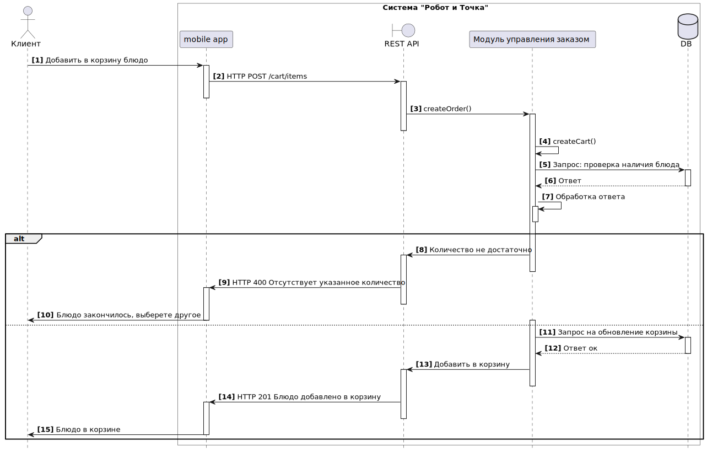
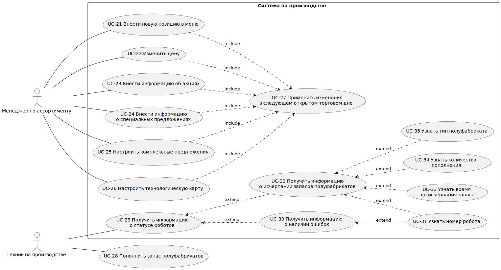

# Требования к системе

## Производительность
**`NFPER1`** Система должна поддерживать 100 одновременных сессий. 
**`NFPER2`** Система должна обеспечить обработку 5000 заказов в сутки. 

## Безопасность

**`NFSEC1`** Система должна предусматривать аутентификацию пользователей в системе по логину и паролю. 
**`NFSEC2`** Система не должна хранить в себе персональных данных пользователей. 

## Масштабируемость

**`NFEXT1`** Система должна обеспечить возможность увеличения количества активных сессий в 100 раз, без снижения производительности, за счёт увеличения доступных вычислительных ресурсов, до 10000 активных сессий. 

## Доступность
**`NFAVL1`** Система должна быть доступна пользователю в режиме 24/7. 
**`NFAVL2`** Допустимое время простоя системы не более 10 минут в сутки. 

## Совместимость

**`NFCOM1`** Система должна размещаться и работать на базе облачной инфраструктуры. 
**`NFCOM2`** Мобильное приложение должно поддерживать работу в операционных системах iOS 4.3 и более поздних и Android 11 и более поздних 
**`NFCOM3`** Десктопный клиент должен работать в среде Windows 
**`NFCOM4`** Система должна обеспечивать поддержку интеграции с терминалом приёма карт на стойке заказов 
**`NFCOM5`** Система должна обеспечить возможность интеграции с платёжными системами для приёма безналичных платежей 

## Поддерживаемость

**`NFSUP1`** В системе должны журналироваться все события, связанные с запросами статусов оплаты у внешних систем. 
**`NFSUP2`** В системе должны журналироваться все события, связанные с операциями в системе лояльности. 

## Удобство использования
**`NFUSE1`** Система должна иметь графический интерфейс администратора, позволяющий настраивать параметры системы. 

## Локализация
**`NFLOC1`** Система должна поддерживать русский язык и иметь интерфейс пользователя на русском языке 

## Функциональные требования к системе

### Use Case диаграмма функций системы для зала ресторана

### Описания Use Case для зала ресторана, реализуемых в рамках MVP

Сценарии зала ресторана

| Вариант использования     | UC-1 Оформление заказа                                                                                                                                                                                                                                                                                                                |
| ------------------------- | ------------------------------------------------------------------------------------------------------------------------------------------------------------------------------------------------------------------------------------------------------------------------------------------------------------------------------------- |
| Область действия          | Мобильное приложение или веб-приложение                                                                                                                                                                                                                                                                                               |
| Основное действующее лицо | Пользователь приложения                                                                                                                                                                                                                                                                                                               |
| Предусловие               | Пользователь находится в корзине, в корзину добавлена хотя бы одна позиция                                                                                                                                                                                                                                                            |
| Результат сценария        | Заказ оформлен, пользователь переходит к оплате                                                                                                                                                                                                                                                                                       |
| Описание                  | 1\. Пользователь завершил формирование корзины и начинает оформление заказа 2\. Система просит выбрать способ получения заказа, с собой или в зале. 3\. Пользователь выбирает способ получения заказа 4\. Система предлагает пользователю войти в систему лояльности. 5\. Пользователь выбирает вход в систему лояльности |
| Альтернативный сценарий   | 4\. Система предлагает пользователю регистрацию в системе лояльности 4.1 Пользователь соглашается. 4.2 Система запускает сценарий UC-2 Регистрация в системе лояльности 5\. Пользователь отказывается входить в систему лояльности. 5.1 Система запускает сценарий оплаты заказа UC-6                                     |
| Исключительные ситуации   | 1\. Пользователь не совершает действий в течении 2-х минут 2\. Система спрашивает пользователя, будет ли он продолжать взаимодействие 3\. Пользователь не совершает действий в течении 2-х минут после запроса системы 4\. Система переходит на начальный экран                                                              |
| Диаграмма   | { width="100" }  |

| Вариант использования     | UC-2 Регистрация в системе лояльности                                                                                                                                                                                                                                                                                                                                                                                                                                                     |
| ------------------------- | ----------------------------------------------------------------------------------------------------------------------------------------------------------------------------------------------------------------------------------------------------------------------------------------------------------------------------------------------------------------------------------------------------------------------------------------------------------------------------------------- |
| Область действия          | Мобильное приложение или веб-приложение                                                                                                                                                                                                                                                                                                                                                                                                                                                   |
| Основное действующее лицо | Пользователь приложения                                                                                                                                                                                                                                                                                                                                                                                                                                                                   |
| Предусловие               | Пользователь начал оформление заказа                                                                                                                                                                                                                                                                                                                                                                                                                                                      |
| Результат сценария        | Пользователь зарегистрировался в системе лояльности                                                                                                                                                                                                                                                                                                                                                                                                                                       |
| Описание                  | 1\. Система предлагает пользователю зарегистрироваться в системе лояльности 2\. Пользователь подтверждает согласие на регистрацию 3\. Система предлагает ввести номер телефона. 4\. Пользователь вводит номер телефона 5\. Система отправляет смс с созданным паролем на номер телефона пользователя 6\. Система предлагает пользователю ввести полученный в смс пароль 7\. Пользователь вводит пароль 8\. Система аутентифицирует пользователя в системе лояльности |
| Альтернативный сценарий   | 2.1 Пользователь отказывается регистрироваться в системе лояльности 2.2 Система прекращает выполнение сценария                                                                                                                                                                                                                                                                                                                                                                         |
| Исключительные ситуации   | 1\. Пользователь не совершает действий в течении 2-х минут 2\. Система спрашивает пользователя, будет ли он продолжать взаимодействие 3\. Пользователь не совершает действий в течении 2-х минут после запроса системы 4\. Система переходит на начальный экран                                                                                                                                                                                                                  |                                                                                                                                         |

| Вариант использования     | UC-3 Ознакомиться с меню                                                                                                                                                                                                                                                 |
| ------------------------- | ------------------------------------------------------------------------------------------------------------------------------------------------------------------------------------------------------------------------------------------------------------------------ |
| Область действия          | Мобильное приложение или веб-приложение                                                                                                                                                                                                                                  |
| Основное действующее лицо | Пользователь приложения                                                                                                                                                                                                                                                  |
| Предусловие               | Пользователь находится на экране меню                                                                                                                                                                                                                                    |
| Результат сценария        | Пользователь ознакомился с ассортиментом товаров                                                                                                                                                                                                                         |
| Описание                  | 1\. Пользователь выбирает раздел меню 2\. Система отображает товары выбранного раздела 3\. Пользователь выбирает товар 4\. Система отображает детальное описание товара                                                                                         |
| Альтернативный сценарий   | 3.1. Пользователь выбирает товар, помеченный как недоступный 3.2. Система информирует пользователя о недоступности товара и предлагает замену                                                                                                                         |
| Исключительные ситуации   | 1\. Пользователь не совершает действий в течении 2-х минут 2\. Система спрашивает пользователя, будет ли он продолжать взаимодействие 3\. Пользователь не совершает действий в течении 2-х минут после запроса системы 4\. Система переходит на начальный экран |

| Вариант использования     | UC-4 Добавить товар в корзину                                                                                                                                                                                                                                                                                     |
| ------------------------- | ----------------------------------------------------------------------------------------------------------------------------------------------------------------------------------------------------------------------------------------------------------------------------------------------------------------- |
| Область действия          | Мобильное приложение или веб-приложение                                                                                                                                                                                                                                                                           |
| Основное действующее лицо | Пользователь приложения                                                                                                                                                                                                                                                                                           |
| Предусловие               | Пользователь находится на детальной странице товара                                                                                                                                                                                                                                                               |
| Результат сценария        | Товар перемещён в корзину                                                                                                                                                                                                                                                                                         |
| Описание                  | 1\. Пользователь выбирает количество товара, которое он хочет переместить в корзину. 2\. Система проверяет возможность добавления товара. 3\. Пользователь перемещает товар в корзину. 4\. Система добавляет товар в состав корзины пользователя. 5\. Система отображает количество позиций в корзине |
| Альтернативный сценарий   | 3.1. Пользователь получает сообщение об отсуствии товара 3.2. Система предлагает выбрать другое блюдо 3.2. Система возвращается к шагу 1.                                                                                                                                                                   |
| Исключительные ситуации   | 1\. Пользователь не совершает действий в течении 2-х минут 2\. Система спрашивает пользователя, будет ли он продолжать взаимодействие 3\. Пользователь не совершает действий в течении 2-х минут после запроса системы 4\. Система переходит на начальный экран                                          |
| Диаграмма   | { width="100" }  |

| Вариант использования     | UC-5 Указать в зале или на вынос                                                                                                                                                                                                                                         |
| ------------------------- | ------------------------------------------------------------------------------------------------------------------------------------------------------------------------------------------------------------------------------------------------------------------------ |
| Область действия          | Мобильное приложение или веб-приложение                                                                                                                                                                                                                                  |
| Основное действующее лицо | Пользователь приложения                                                                                                                                                                                                                                                  |
| Предусловие               | Пользователь находится на странице корзины                                                                                                                                                                                                                               |
| Результат сценария        | Пользователь выбрал, каким способом он хочет забрать заказ                                                                                                                                                                                                               |
| Описание                  | 1\. Система предлагает пользователю выбор из двух способов забрать заказ: с собой или в зале. 2\. Пользователь выбирает один из способов забрать заказ. 3\. Система запоминает выбор пользователя для текущего заказа                                              |
| Альтернативный сценарий   | 2.1. Пользователь не выбрал ни один из вариантов 2.2. Система предлагает выбрать способ забрать заказ в момент перехода пользователя к оплате заказа.                                                                                                                 |
| Исключительные ситуации   | 1\. Пользователь не совершает действий в течении 2-х минут 2\. Система спрашивает пользователя, будет ли он продолжать взаимодействие 3\. Пользователь не совершает действий в течении 2-х минут после запроса системы 4\. Система переходит на начальный экран |

| Вариант использования     | UC-6 Произвести оплату                                                                                                                                                                                                                                                                                                                                                   |
| ------------------------- | ------------------------------------------------------------------------------------------------------------------------------------------------------------------------------------------------------------------------------------------------------------------------------------------------------------------------------------------------------------------------ |
| Область действия          | Мобильное приложение или веб-приложение                                                                                                                                                                                                                                                                                                                                  |
| Основное действующее лицо | Пользователь приложения                                                                                                                                                                                                                                                                                                                                                  |
| Предусловие               | Пользователь начал процедуру оформления заказа Пользователь вошёл в систему лояльности или отказался от входа и регистрации                                                                                                                                                                                                                                           |
| Результат сценария        | Пользователь выбрал способ оплаты товара                                                                                                                                                                                                                                                                                                                                 |
| Описание                  | 1\. Пользователь инициирует оплату заказа 2\. Система предлагает выбрать способ оплаты заказа 3\. Пользователь выбирает один из способов оплатить заказ 4\. Система переходит к сценарию оплаты в зависимости от выбора пользователя.                                                                                                                           |
| Альтернативный сценарий   | 2.1 Система предлагает выбор из трех вариантов оплаты, если пользователь взаимодействует с системой на терминале самообслуживания в зале. 2.2 Система предлагает оплату по карте или списание баллов, если пользоваель взаимодействует с системой через мобильное приложение. 3.1. Пользователь выбирает возврат в корзину. 3.2. Система возвращается к шагу 1. |
| Исключительные ситуации   | 1\. Пользователь не совершает действий в течении 2-х минут 2\. Система спрашивает пользователя, будет ли он продолжать взаимодействие 3\. Пользователь не совершает действий в течении 2-х минут после запроса системы 4\. Система переходит на начальный экран                                                                                                 |

| Вариант использования     | UC-7 Оплата через СБП                                                                                                                                                                                                                                                                                                                                                                                         |
| ------------------------- | ------------------------------------------------------------------------------------------------------------------------------------------------------------------------------------------------------------------------------------------------------------------------------------------------------------------------------------------------------------------------------------------------------------- |
| Область действия          | Мобильное приложение или веб-приложение                                                                                                                                                                                                                                                                                                                                                                       |
| Основное действующее лицо | Пользователь приложения                                                                                                                                                                                                                                                                                                                                                                                       |
| Предусловие               | Пользователь выбрал способ оплаты заказа: оплата через СБП                                                                                                                                                                                                                                                                                                                                                    |
| Результат сценария        | Заказ оплачен                                                                                                                                                                                                                                                                                                                                                                                                 |
| Описание                  | 1\. Система предлагает пользователю оплату через СБП и отображает сумму оплаты 2\. Пользователь подтверждает оплату через СБП 3\. Система запускает оплату через СБП 4\. Пользователь выполняет оптату 5\. Система запрашивает у СБП подтверждение оплаты. 6\. Система получает подтверждение оплаты. 7\. Система информирует пользователя об успешной оплате. 8\. Система печатает чек. |
| Альтернативный сценарий   | 6.1. Система не получает подтверждения оплаты. 6.2 Система сообщает пользователю о том что оплата не выполена. 6.3 Система возвращается на шаг 1.                                                                                                                                                                                                                                                       |
| Исключительные ситуации   | 1\. Пользователь не совершает действий в течении 2-х минут 2\. Система спрашивает пользователя, будет ли он продолжать взаимодействие 3\. Пользователь не совершает действий в течении 2-х минут после запроса системы 4\. Система возращается на главный экран                                                                                                                                      |

| Вариант использования     | UC-8 Списать баллы                                                                                                                                                                                                                                                                                                                                                    |
| ------------------------- | --------------------------------------------------------------------------------------------------------------------------------------------------------------------------------------------------------------------------------------------------------------------------------------------------------------------------------------------------------------------- |
| Область действия          | Мобильное приложение или веб-приложение                                                                                                                                                                                                                                                                                                                               |
| Основное действующее лицо | Пользователь приложения                                                                                                                                                                                                                                                                                                                                               |
| Предусловие               | Пользователь выбрал способ оплаты заказа: списание баллов                                                                                                                                                                                                                                                                                                             |
| Результат сценария        | Стоимость заказа уменьшена за счёт списания баллов                                                                                                                                                                                                                                                                                                                    |
| Описание                  | 1\. Система отображает количество доступных для списания баллов и сумму заказа. 2\. Пользователь указывает количество баллов, которое хочет списать. 3\. Система запрашивает подтверждение списания выбранного пользователем количества баллов. 4\. Пользователь подтверждает списание. 5\. Система отображает стоимость заказа с учётом списания баллов. |
| Альтернативный сценарий   | 5.1. Пользователь указал количество баллов равное или больше стоимости заказа на шаге 2. 5.2 Система списывает сумму баллов, не превышающих стоимость заказа. 5.3. Система информирует пользователя, что заказ оплачен.                                                                                                                                         |
| Исключительные ситуации   | Пользователь не совершает действий в течении 2-х минут Система спрашивает пользователя, будет ли он продолжать взаимодействие Пользователь не совершает действий в течении 2-х минут после запроса системы Система переходит на начальный экран                                                                                                              |

| Вариант использования     | UC-7 Оплата по карте                                                                                                                                                                                                                                                                                                                                                                                                                    |
| ------------------------- | --------------------------------------------------------------------------------------------------------------------------------------------------------------------------------------------------------------------------------------------------------------------------------------------------------------------------------------------------------------------------------------------------------------------------------------- |
| Область действия          | Веб-приложение                                                                                                                                                                                                                                                                                                                                                                                                                          |
| Основное действующее лицо | Пользователь приложения                                                                                                                                                                                                                                                                                                                                                                                                                 |
| Предусловие               | Пользователь выбрал способ оплаты заказа: оплата по карте                                                                                                                                                                                                                                                                                                                                                                               |
| Результат сценария        | Заказ оплачен                                                                                                                                                                                                                                                                                                                                                                                                                           |
| Описание                  | 1\. Система предлагает пользователю оплату картой и отображает сумму оплаты. 2\. Пользователь подтверждает оплату картой 3\. Система запускает оплату терминал оплаты картой. 4\. Пользователь прикладывает карту к терминалу. 5\. Система запрашивает у банка подтверждение оплаты. 6\. Система получает подтверждение оплаты. 7\. Система информирует пользователя об успешной оплате. 8\. Система печатает чек. |
| Альтернативный сценарий   | 6.1. Система не получает подтверждения оплаты. 6.2 Система сообщает пользователю о том что оплата не выполена. 6.3 Система возвращается на шаг 1.                                                                                                                                                                                                                                                                                 |
| Исключительные ситуации   | 1\. Пользователь не совершает действий в течении 2-х минут 2\. Система спрашивает пользователя, будет ли он продолжать взаимодействие 3\. Пользователь не совершает действий в течении 2-х минут после запроса системы 4\. Система возращается на главный экран                                                                                                                                                                |

| Вариант использования     | UC-10 Получить талон с номером заказа                                                                                                                                                                                                                                            |
| ------------------------- | -------------------------------------------------------------------------------------------------------------------------------------------------------------------------------------------------------------------------------------------------------------------------------- |
| Область действия          | Веб-приложение                                                                                                                                                                                                                                                                   |
| Основное действующее лицо | Пользователь приложения                                                                                                                                                                                                                                                          |
| Предусловие               | Пользователь успешно завершил оплату заказа                                                                                                                                                                                                                                      |
| Результат сценария        | Пользователь получил талон с номером заказа                                                                                                                                                                                                                                      |
| Описание                  | 1\. Система отображает номер оплаченного заказа на экране 2\. Система печатает талон с номером заказа. 2\. Пользователь видит номер заказа. 4\. Пользователь берёт напечатанный талон с номером заказа. 3\. Система ожидает 20 секунд и переходит на начальный экран |
| Альтернативный сценарий   |                                                                                                                                                                                                                                                                                  |
| Исключительные ситуации   | 1\. Пользователь не совершает действий в течении 2-х минут 2\. Система спрашивает пользователя, будет ли он продолжать взаимодействие 3\. Пользователь не совершает действий в течении 2-х минут после запроса системы 4\. Система переходит на начальный экран         |

| Вариант использования     | UC-14 Оформить отказ от покупки                                                                                                                                                                                                                                                                                                                                                                                                                                                                                                                                                                                 |
| ------------------------- | --------------------------------------------------------------------------------------------------------------------------------------------------------------------------------------------------------------------------------------------------------------------------------------------------------------------------------------------------------------------------------------------------------------------------------------------------------------------------------------------------------------------------------------------------------------------------------------------------------------- |
| Область действия          | Мобильное приложение или веб-приложение                                                                                                                                                                                                                                                                                                                                                                                                                                                                                                                                                                         |
| Основное действующее лицо | Менеджер по гостеприимству                                                                                                                                                                                                                                                                                                                                                                                                                                                                                                                                                                                      |
| Предусловие               | Посетитель запросил отказ от заказа Менеджер по гостеприимству авторизован в системе с ролью менеджера по гостеприимству                                                                                                                                                                                                                                                                                                                                                                                                                                                                                     |
| Результат сценария        | Заказ отменён                                                                                                                                                                                                                                                                                                                                                                                                                                                                                                                                                                                                   |
| Описание                  | 1\. Менеджер по гостеприимству уточняет у посетителя, какой заказ он хочет отменить. 2\. Посетитель сообщает номер заказа. 3\. Менеджер по гостеприимству запрашивает у системы список не выданных заказов. 4\. Система отображает список заказов, которые не были выданы. 5\. Менеджер по гостеприимству находит нужный заказ. 6\. Менеджер по гостеприимству отменяет выполнение заказа. 7\. Система помечает заказ как отменённый, удаляет заказ из очереди заказов на производство. 8\. Система помечает заказ как не доступный к выдаче и удаляет заказ из очереди заказов на выдачу. |
| Альтернативный сценарий   | 5.1 Менеджер по гостеприимству не находит заказ в очереди не выданных заказов. 5.2 Менеджер по гостеприимству запрашивает у системы список выданных заказов. 5.3 Система отображает список выданных заказов. 5.4 Менеджер по гостеприимству находит заказ в списке выданных. 5.5. Менеджер по гостеприимству решает конфликтную ситуацию с посетителем, который хочет отменить уже выданный заказ.                                                                                                                                                                                                  |

| Вариант использования     | UC-16 Вернуть на карту                                                                                                                                                                                                                                                                                                                                                                                                                                                                                                                                                                                                                                                                                                                                                          |
| ------------------------- | ------------------------------------------------------------------------------------------------------------------------------------------------------------------------------------------------------------------------------------------------------------------------------------------------------------------------------------------------------------------------------------------------------------------------------------------------------------------------------------------------------------------------------------------------------------------------------------------------------------------------------------------------------------------------------------------------------------------------------------------------------------------------------- |
| Область действия          | Мобильное приложение или веб-приложение                                                                                                                                                                                                                                                                                                                                                                                                                                                                                                                                                                                                                                                                                                                                         |
| Основное действующее лицо | Менеджер по гостеприимству                                                                                                                                                                                                                                                                                                                                                                                                                                                                                                                                                                                                                                                                                                                                                      |
| Предусловие               | Заказ посетителя отменён. Посетитель требует возврат денег Оплата заказа была выполнена по карте Менеджер по гостеприимству авторизован в системе с ролью менеджера по гостеприимству                                                                                                                                                                                                                                                                                                                                                                                                                                                                                                                                                                                  |
| Результат сценария        | Запущена процедура возврата средств на карту посетителя                                                                                                                                                                                                                                                                                                                                                                                                                                                                                                                                                                                                                                                                                                                         |
| Описание                  | 1\. Менеджер по гостеприимству запрашивает у системы список отменённых заказов. 2\. Система формирует список отменённых заказов. 3\. Менеджер по гостеприимству выбирает отменённый заказ. 4\. Система отображает информацию о заказе и способе оплаты. 5\. Менеджер по гостеприимству убеждается, что оплата была выполена по карте. 6\. Менеджер по гостеприимству запускает процедуру отмены оплаты по карте. 7\. Система формирует запрос отмены оплаты в банк. 8\. Система ожидает подтверждения отмены оплаты. 9\. Система получает подтверждение отмены оплаты и информирует менеджера по гостеприимству о успешном завершении операции. 10\. Менеджер по гостеприимству информирует посетителя о том что средства будут возвращены на карту. |
| Альтернативный сценарий   | 5.1 Менеджер по гостеприимству видит что оплата была выполнена через СБП. 5.2 Менеджер по гостеприимству запускает отмену оплаты через СБП.                                                                                                                                                                                                                                                                                                                                                                                                                                                                                                                                                                                                                                  |

| Вариант использования     | UC-17 Вернуть через СБП                                                                                                                                                                                                                                                                                                                                                                                                                                                                                                                                                                                                                                                                                                                                                                                                             |
| ------------------------- | ----------------------------------------------------------------------------------------------------------------------------------------------------------------------------------------------------------------------------------------------------------------------------------------------------------------------------------------------------------------------------------------------------------------------------------------------------------------------------------------------------------------------------------------------------------------------------------------------------------------------------------------------------------------------------------------------------------------------------------------------------------------------------------------------------------------------------------- |
| Область действия          | Мобильное приложение или веб-приложение                                                                                                                                                                                                                                                                                                                                                                                                                                                                                                                                                                                                                                                                                                                                                                                             |
| Основное действующее лицо | Менеджер по гостеприимству                                                                                                                                                                                                                                                                                                                                                                                                                                                                                                                                                                                                                                                                                                                                                                                                          |
| Предусловие               | Заказ посетителя отменён. Посетитель требует возврат денег Оплата заказа была выполнена через СБП Менеджер по гостеприимству авторизован в системе с ролью менеджера по гостеприимству                                                                                                                                                                                                                                                                                                                                                                                                                                                                                                                                                                                                                                     |
| Результат сценария        | Запущена процедура возврата средств посетителю через СБП                                                                                                                                                                                                                                                                                                                                                                                                                                                                                                                                                                                                                                                                                                                                                                            |
| Описание                  | 1\. Менеджер по гостеприимству запрашивает у системы список отменённых заказов. 2\. Система формирует список отменённых заказов. 3\. Менеджер по гостеприимству выбирает отменённый заказ. 4\. Система отображает информацию о заказе и способе оплаты. 5\. Менеджер по гостеприимству убеждается, что оплата была выполена через СБП. 6\. Менеджер по гостеприимству запускает процедуру отмены оплаты по номеру телефона посетителя через СБП. 7\. Система формирует запрос отмены оплаты в банк. 8\. Система ожидает подтверждения отмены оплаты. 9\. Система получает подтверждение отмены оплаты и информирует менеджера по гостеприимству о успешном завершении операции. 10\. Менеджер по гостеприимству информирует посетителя о том что средства будут возвращены по номеру телефона через СБП. |
| Альтернативный сценарий   | 5.1 Менеджер по гостеприимству видит что оплата была выполнена по карте. 5.2 Менеджер по гостеприимству запускает отмену оплаты по карте.                                                                                                                                                                                                                                                                                                                                                                                                                                                                                                                                                                                                                                                                                        |

### Use Case диаграмма функций системы на производстве

### Описания Use Case для производства ресторана, реализуемых в рамках MVP

Сценарии производства ресторана

## Карта пользовательских историй User Story Map

**Defenition of Ready** 

- US имеет ясное и краткое описание
- DоD определены и утверждены командой
- Все необходимые ресурсы, технические спецификации и прототипы доступны
- Все зависимости от других US зафиксированы
- US приоритезирована и оценена командой
- Команда договорилась об Acceptance Criteria

**Defenition of Done** 

- Реализация US соответствует Acceptance Criteria
- Код, связанный с историей, выложен в систему контроля версий
- Историю принял аналитик
- Тестовые сценарии успешно пройдены
- Изменения отражены в документации

## Карта пользовательских историй в Miro
<a id="raw-url" href="https://miro.com/app/board/uXjVNomrtxc=/">Ссылка на полную UserStoryMap в Miro</a>
