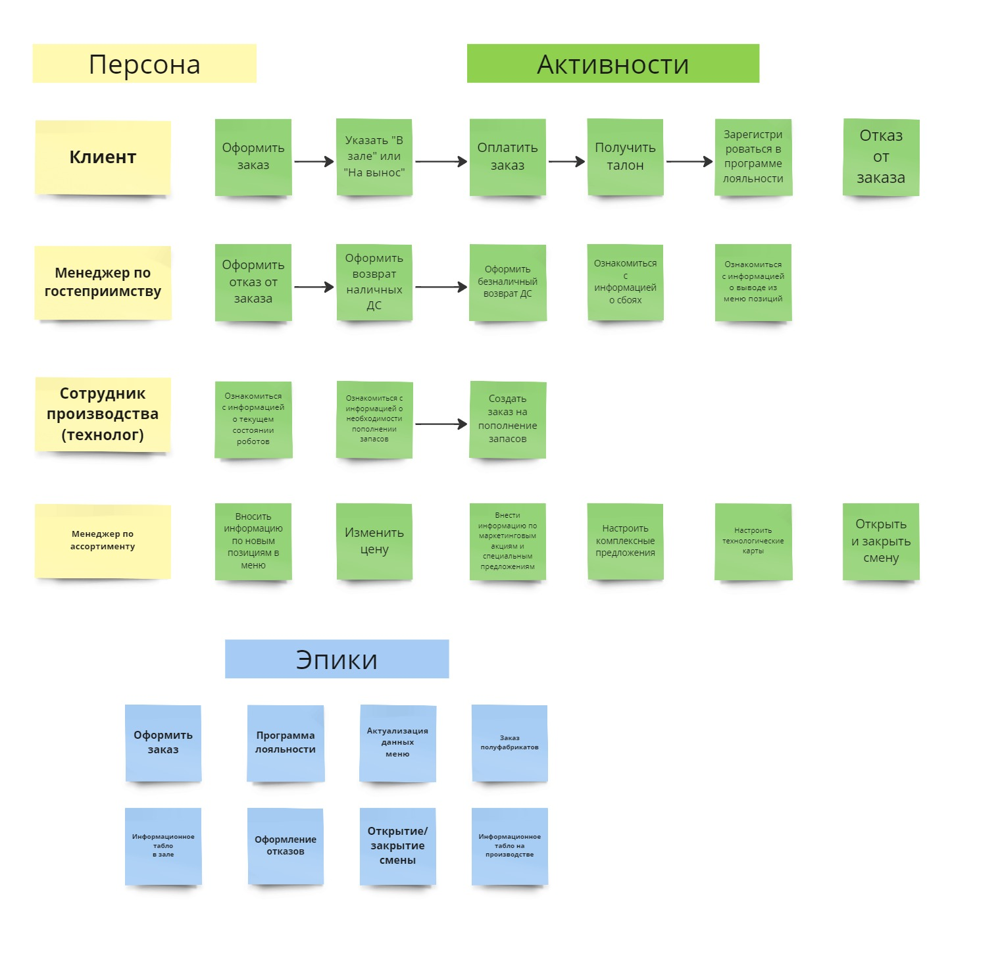

# Требования к системе

## Производительность
**`NFPER1`** Система должна поддерживать 100 одновременных сессий. 
**`NFPER2`** Система должна обеспечить обработку 5000 заказов в сутки. 

## Безопасность

**`NFSEC1`** Система должна предусматривать аутентификацию пользователей в системе по логину и паролю. 
**`NFSEC2`** Система должна предусматривать аутентификацию посетителей в системе по номеру телефона и паролю. 
**`NFSEC3`** Система не должна хранить в себе персональных данных пользователей. 

## Масштабируемость

**`NFEXT1`** Система должна обеспечить возможность увеличения количества одновременно работающих с системой пользователей в 100 раз, без снижения производительности, за счёт увеличения доступных вычислительных ресурсов. 

## Доступность
**`NFAVL1`** Система должна быть доступна пользователю в режиме 24/7. 
**`NFAVL2`** Допустимое время простоя системы не более 10 минут в сутки. 

## Совместимость

**`NFCOM1`** Система должна размещаться и работать на базе облачной инфраструктуры. 
**`NFCOM2`** Мобильное приложение должно поддерживать работу в операционных системах iOS и Android 
**`NFCOM3`** Мобильное приложение должно быть нативным 
**`NFCOM4`** Десктопный клиент должен работать в среде Windows 
**`NFCOM5`** Система должна обеспечивать поддержку интеграции с терминалом приёма карт на стойке заказов 
**`NFCOM6`** Система должна обеспечивать поддержку интеграции с терминалом приёма наличных на стойке заказов 
**`NFCOM7`** Система должна обеспечить возможность интеграции с платёжными системами для приёма безналичных платежей 

## Поддерживаемость

**`NFSUP1`** В системе должны журналироваться все события, связанные с запросами статусов оплаты у внешних систем. 
**`NFSUP2`** В системе должны журналироваться все события, связанные с операциями в системе лояльности. 

## Удобство использования
**`NFUSE1`** Система должна иметь графический интерфейс администратора, позволяющий настраивать параметры системы. 

## Локализация
**`NFLOC1`** Система должна поддерживать русский язык и иметь интерфейс пользователя на русском языке 

## Функциональные требования к системе

### Use Case диаграмма функций системы для зала ресторана

![PlantUML model](//www.plantuml.com/plantuml/png/ZLJTQXDH4BxFKmoviXSjRQtz4P62Zo1UX-tcc8PiTkF-eBchHYhOqe88WeWYla2I9YQsJV8APz_8RyxcxDcJjA6KTC_FVD_CcVbc3gFO2UEawPKyyJgcEA2mNZkEgLeFXHlN0xyKDUf-omcT9hKSj-7KnCkuxGdYQyUlUQBak74GKbd-ajFqlHoc7-GOlw6yIS_Bv4JaUd5kymFd4_m6yYyiJmYRBiahHYhCB3sHO_pTgdrV3XL3inQMIaaaN2SI58HL4V9f-TMBzIsIFzEFSWhOBRjDpqcEP5TUupSgvnWlQ3kUncmJh8TmEcOdM7VJKwmlIVO93nXdeO1lIF86r9Vy4ZcPnpWsh4tX9vhqCGA1vudoFTN10749Jc8oEKal3DQfLYj7JjGGiMRO8VaLo1uO-lefCnoCi3dbf71yJ8w8SGQwZg6BdOQenEsMq6nFIFx9iY2x6LS_oymDFskCptYU_7vwbZtEiBMSjkRP9LMJAI0ZhaUM0yB131nCtR5m5TyaUWyvqMRmnExOR_e9iPznYcpaKU8daSRka_mDB8gXu-yn6gKuir6k4rOrw631uJKM9rXEvRzYghp0p_MpIQnRq7OGLfPrndBXvKILRiBbPB7orwWBNyCP7GTlApRn5eYLpWRfPqYelqI-K3nRrjialy6mn-gyLzLku4Sv0WByphGeK8S5ouuoNHl04Heu1-pSqJfJe9GJjSpqTms-6KuNgcLnGMrVE4Kioenfe0H_Bg-AEF76XkqkmIQcR9Qoe2eRkhS4jTKrB7WDmy1aTd-vuDpq25GH86Hcl23ki3mzAfF5zdMF6vKWYNFMWoNMEmcoRkl3Sf2ruIWV3GlDRhl24_BfjVbGLrD-M0-cGskiSGELYASohQ_J8nvYQuMzqc7nm6YxUCh5q7jiMOgypHOuuP5D_9-jkGAyPGCrYjTeuxbsHKz9l8k5N-LRummcR6DwWmthlkibLQ6eSlopZVah39EvL2HcsDeabb4-GbVOGFZsBP-OEnv-A-zvMAqqK3FGjZ34oaebnxOmrAjD5FdzDhfUfhhvdj7wBBja5dD-bpDZXU0VO3KV3ainAV6WoAZol1LCePUlqPI5wqFyIvhUVm00)

### Описания Use Case для зала ресторана, реализуемых в рамках MVP

Сценарии зала ресторана

### Use Case диаграмма функций системы на производстве

![PlantUML model](//www.plantuml.com/plantuml/png/ZLJTIXj15BxVfnXofHU6QhG_fHIXZr1wBSjc6XUJtML_e58A9cfjKUmB50fzWXYDBfiqliBC6_Kxu_IuOvCGs6Lspy_tVUUScTdDSZ_DYrxNwygFkSXZaOQT_LoqmrG6UHX7NdOGHecV-ZsH-C61tv7lyyEk5EJseqvNUdwGnwbeg9zghFxWlL6tQgoFXBfNCw66kg_xQgQFz42LQaenUg2F6yBFHA-Jffp-6qcd02XL9R0CaQ-Fr0p_Tsg4zGP00toDJMekWttFOn52_PeRF1EVlIAJWPz9uRVRUqcSKNRZmxkDhKs100WseIKuaJVIn_hIA0TGgR_YnUz8ME6N3KOh4g2bOI0PRqiOUXE9l86-40303wfrHA1YJcez4L4Y_8JQ1PoXvOUOApHILUR_XpvruR941eotlIeUXdAFC5Y0FD4NY3lNfwRfPeOJHDsI-dcKGTnBc7B7Z8i8QGIsSbNXSmgA2J0ga05UZHV0k-0qMWP_FWzS3-nUcHcSQvZFg6GGcV5LoC1-S_gU9Dr3Hdtn8AHqXbMRdjL5amVgX1GJilwEhodw1m4L6Cwnpc2W1N3Nj86C0GK2fE4vTOLHXmMyD7lCl1CM0FeXJAXMF7Z0UGBJbP6AeWpTwB4edDsyo1ZqrMFQcOLSC7z13IKyXFOn5jFRAuGz8GZs3_PaclvZQ3rRdO76XjfA2bGbBFeRFi2XAXS_AdgClodqiRgZL8Dj9ZobowIkSFYOtvP9pCbRgul3saSGWAdVe34IkVtKX1L7G1NaOK-oYjQJ4aPcmqzfCztCPOQdnZnqeOEuY7B6tcPiFcEsnME-xvnzzT_v0cPz7xPsN4HpHzylBXtgF66kRR6n8TRiZRfUj_6zw5ZjjUVQxDtb6ktjuXhjhK16Mjc8KcesUnvWmCFYHBFvrXx_roACWcxHbkHdeGiYMFHIFnMmD82AMHf0uXS5uB5d_4spATRiSLn7ZFoKowZj-kaqr5qSpzbqs9niIbdLYsOlyF9ENUAdGr9pV_5siHIzxby0)

### Описания Use Case для производства ресторана, реализуемых в рамках MVP

Сценарии производства ресторана

## Карта пользовательских историй User Story Map

**Defenition of Ready** 

- US имеет ясное и краткое описание
- DоD определены и утверждены командой
- Все необходимые ресурсы, технические спецификации и прототипы доступны
- Все зависимости от других US зафиксированы
- US приоритезирована и оценена командой
- Команда договорилась об Acceptance Criteria

**Defenition of Done** 

- Реализация US соответствует Acceptance Criteria
- Код, связанный с историей выложен в систему контроля версий
- Историю принял аналитик
- Тестовые сценарии успешно пройдены
- Изменения отражены в документации

<a id="raw-url" href="https://otus.ru/redirect/?to=https%3A%2F%2Fmiro.com%2Fapp%2Fboard%2FuXjVNomrtxc%3D%2F%3Fshare_link_id%3D601247181371">Ссылка на полную UserStoryMap в Miro</a>
