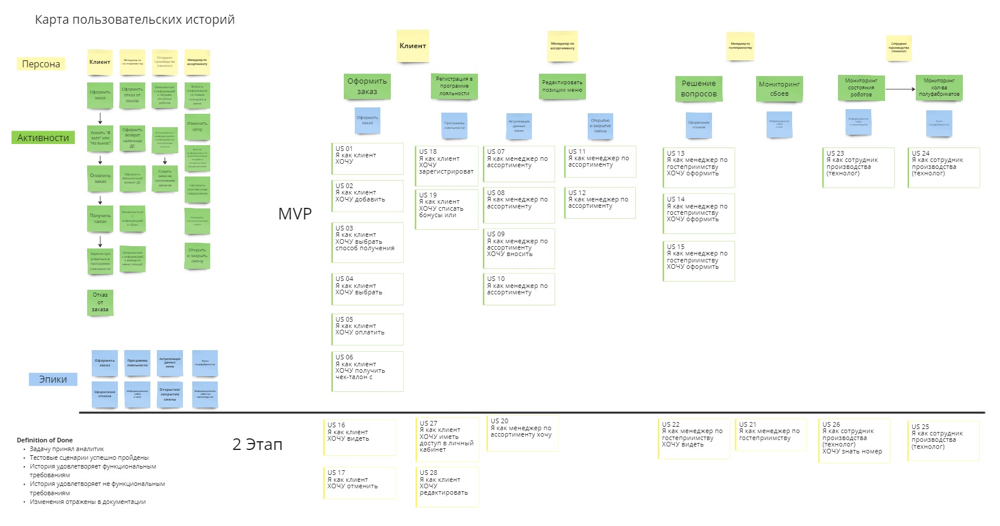

# Шаблоны элементов markdown

## Списки с чекбоксами

Task List

-   [X] item 1
    *   [X] item A
    *   [ ] item B
        more text
        +   [x] item a
        +   [ ] item b
        +   [x] item c
    *   [X] item C
-   [ ] item 2
-   [ ] item 3

## Картинка

## Кликабельная картинка

[Userstoy](images/UserStoryMap.jpg)

## Диаграмма UML

## Загрузка файла

<a id="raw-url" href="https://raw.githubusercontent.com/rushydra/robot/main/docs/wireframe/mobile_app.pdf">Скачать макет интерфейса в формате PDF</a>