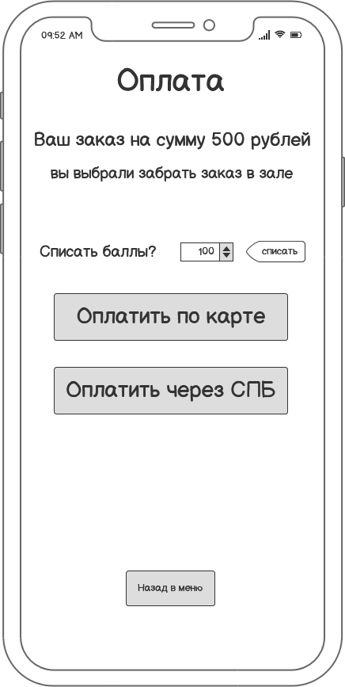
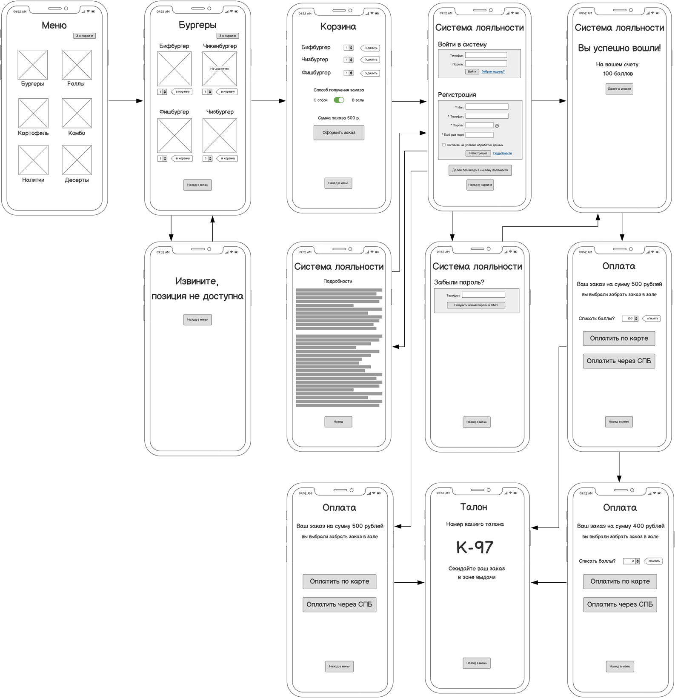

# Пользовательский интерфейс системы

## Экранные формы мобильного приложения

WF1 Меню

WF2 Раздел меню

WF3 Корзина

WF4 Регистрация и вход в систему лояльности

WF5 Восстановление пароля

WF6 Оплата

WF7 Талон на получение заказа

## Схема экранных форм мобильного приложения

## Прототип мобильного приложения

Кликабельный прототип мобильного приложения в формате .pdf можно скачать по ссылке: 
<a id="raw-url" href="https://raw.githubusercontent.com/rushydra/robot/main/docs/wireframe/mobile_app_v2.pdf">Скачать макет интерфейса в формате PDF</a>